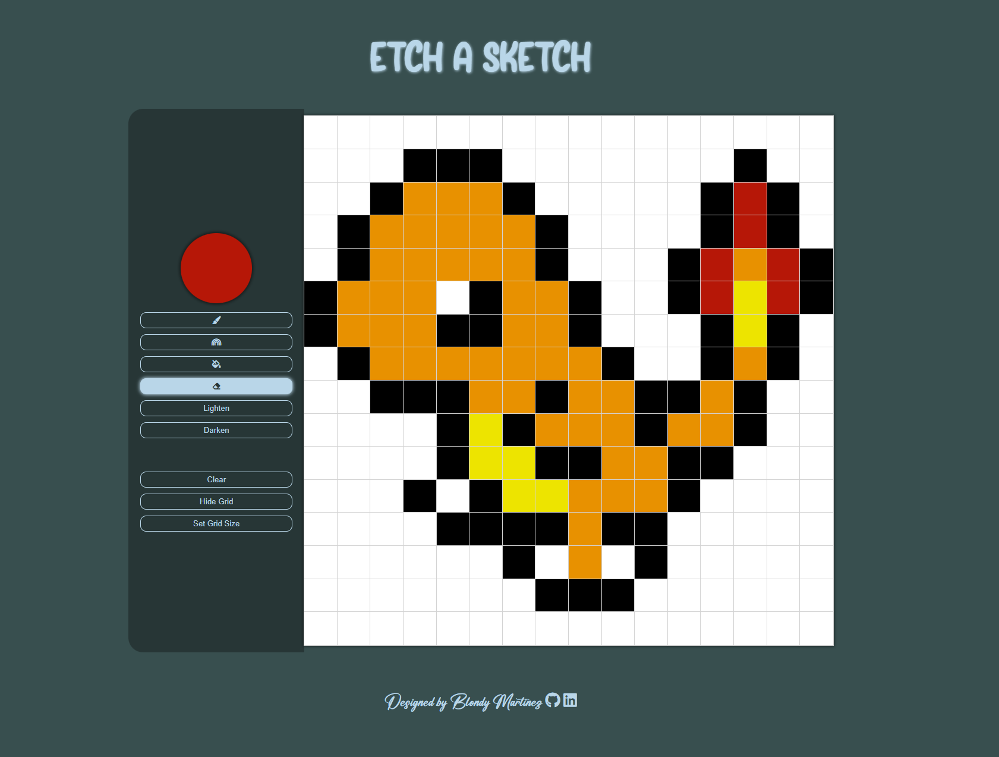

# Etch-A-Sketch

Welcome to my take of Etch a Sketch! You can draw pixel art in this simple website!

## Technologies Used 🛠️

- HTML
- CSS
- JavaScript

## Features ✨

- Random color mode.
- Ability to pick color.
- Bucket fill.
- Lighten & Darken.

## Try it out! 🚀

You can play the game live [here](https://blondymartinez.github.io/Etch-A-Sketch/)

## Screenshot 📸

